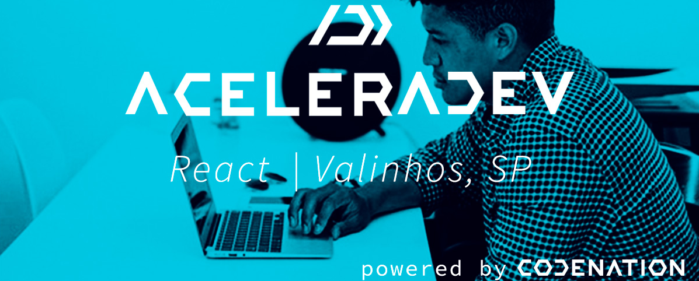
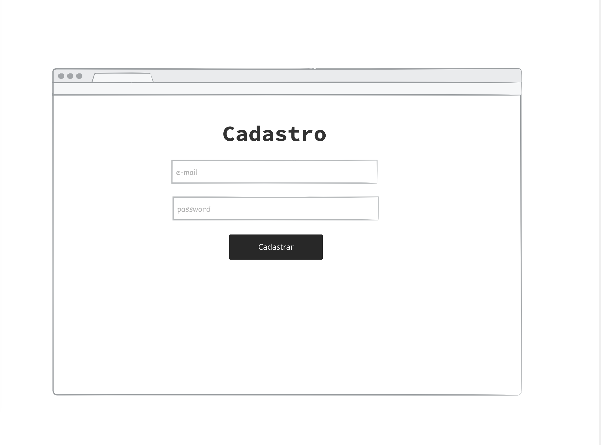
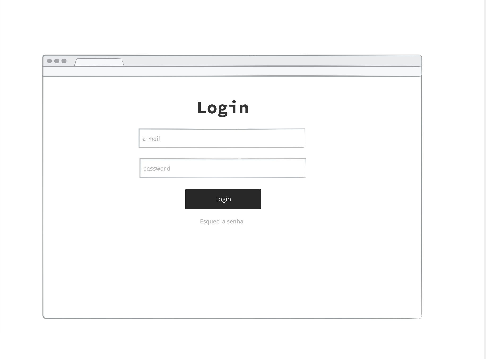
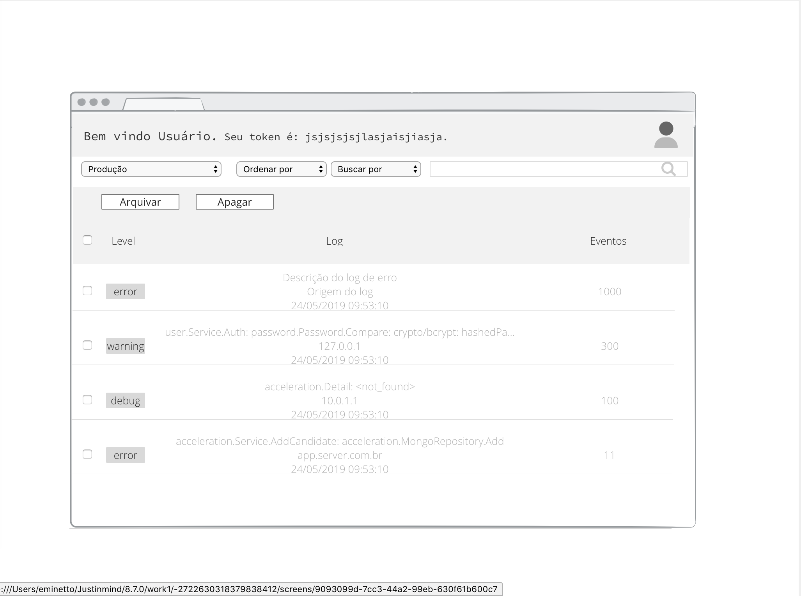
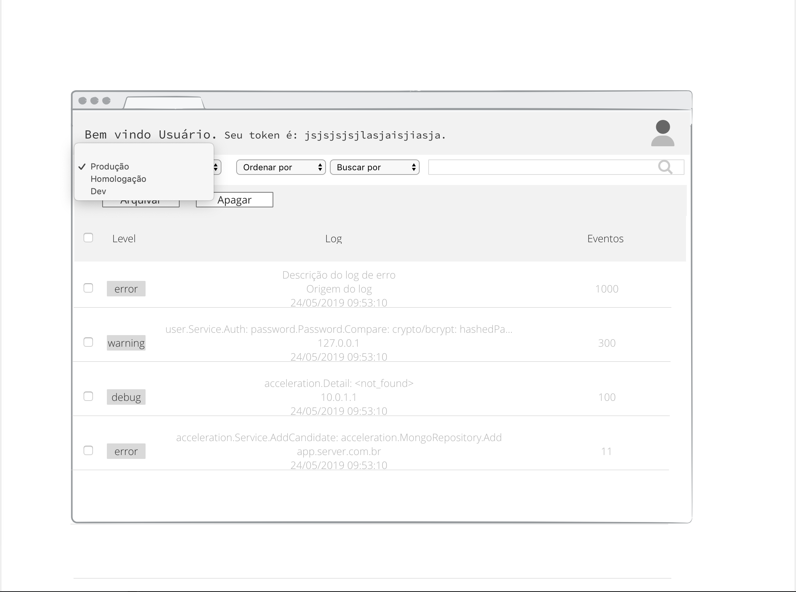
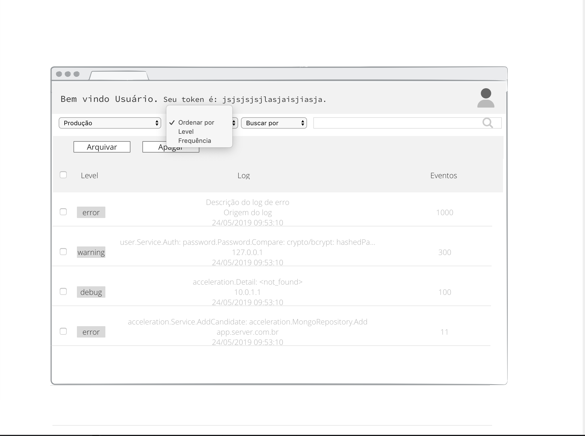
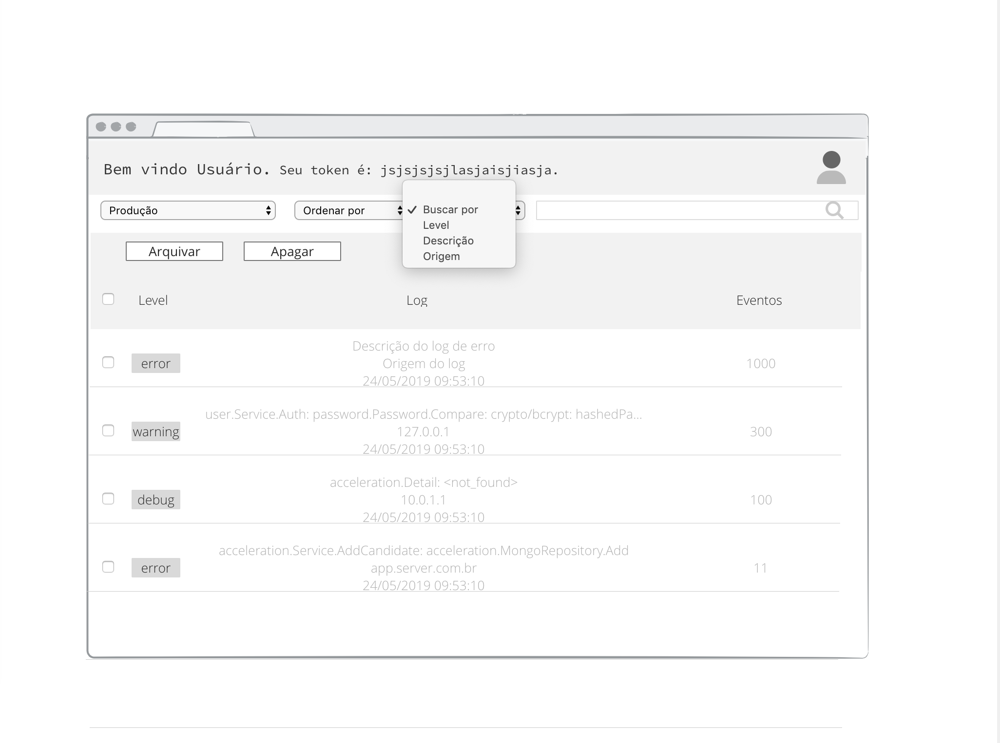
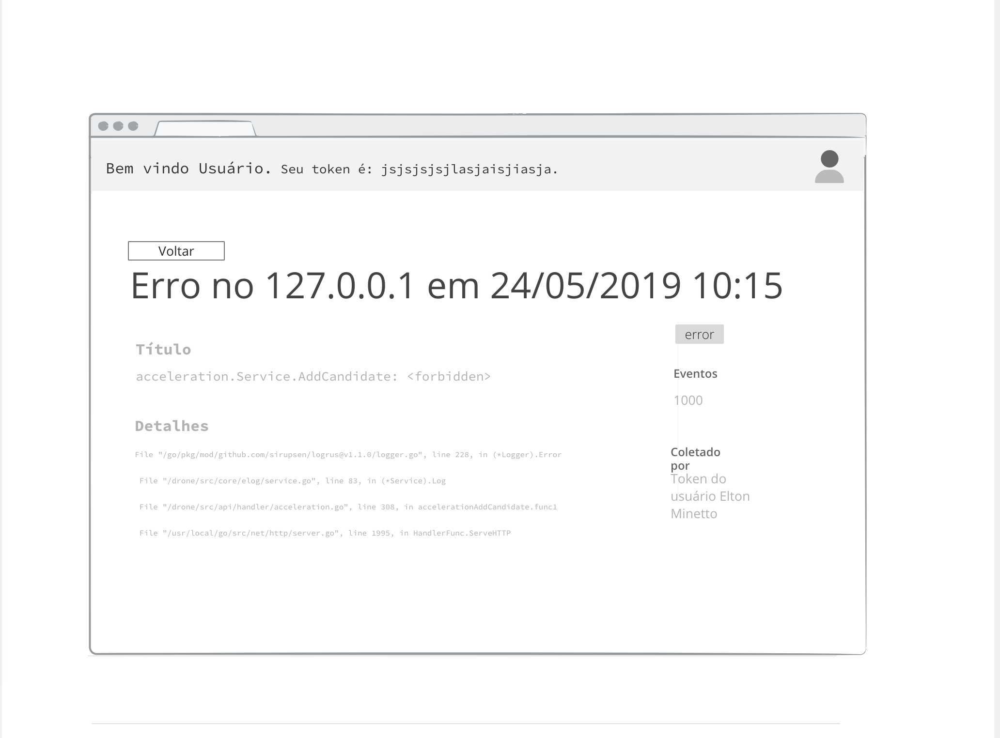

  

<h1 align="center"> 📟 Projeto Final ( Event Log Tracker )</h1>

<!-- ************************************* Baadges ********************************************* -->

  

 

  

  <a href="#sobre">Sobre o Projeto</a>&nbsp;&nbsp;&nbsp;|&nbsp;&nbsp;&nbsp;
  <a href="#objetivos">Objetivos do Projeto</a>&nbsp;&nbsp;&nbsp;|&nbsp;&nbsp;&nbsp;
  <a href="#ferramentas">Ferramentas e Bibliotecas</a>&nbsp;&nbsp;&nbsp;|&nbsp;&nbsp;&nbsp;
  <a href="#imagens">Imagens do Projeto</a>&nbsp;&nbsp;&nbsp;|&nbsp;&nbsp;&nbsp;
  <a href="#documentacao">Documentação do Projeto</a>&nbsp;&nbsp;&nbsp;|&nbsp;&nbsp;&nbsp;

<h2 id="sobre"> 🚀 Sobre o Projeto </h2>

Event Log Tracker é uma plataforma que tem como objetivo principal centralizar logs (eventos) dos sistemas em um único local, para que seja possível fazer o gerenciamento de forma fácil e rápida.

Event Log Tracker é um projeto de trabalho final do curso AceleraDev React da Codenation em parceria com Kroton.

<h2 id="objetivos"> 📝 Objetivos do Projeto </h2>

Em projetos modernos é cada vez mais comum o uso de arquiteturas baseadas em serviços ou microsserviços. Nestes ambientes complexos, erros podem surgir em diferentes camadas da aplicação (backend, frontend, mobile, desktop) e mesmo em serviços distintos. Desta forma, é muito importante que os desenvolvedores possam centralizar todos os registros de erros em um local, de onde podem monitorar e tomar decisões mais acertadas. Neste projeto vamos implementar um sistema para centralizar registros de erros de aplicações.

> ### Backend - API
* Criar endpoints para serem usados pelo frontend da aplicação;
* Criar um endpoint que será usado para gravar os logs de erro em um banco de dados relacional;
* A API deve ser segura, permitindo acesso apenas com um token de autenticação válido;

> ### Frontend
* Deve implementar as funcionalidades apresentadas nos wireframes;
* Deve ser acessada adequadamente tanto por navegadores desktop quanto mobile;
* Deve consumir a API do produto;
* Desenvolvida na forma de uma Single Page Application;

> ### Observações
* Se a aceleração tiver ênfase no backend (Java, Python, C#, Go, PHP, etc) a equipe deve obrigatoriamente implementar a API. A implementação do frontend é considerado um bônus importante
* Se a aceleração tiver ênfase em frontend (React, Vue, Angular, etc) a equipe deve obrigatoriamente implementar o frontend da aplicação e o backend pode ser substituido por uma aplicação mock. A implementação da API é considerado um bônus importante

> ### Wireframes
Os wireframes a seguir servem para ilustrar as funcionalidades básicas que a aplicação deverá ter, porém o time terá total liberdade para definir os detalhes de implementação e estratégia a ser utilizada no desenvolvimento.

  
  
  
  
  
  
  

<h2 id="ferramentas">🧰 Ferramentas e Bibliotecas</h2>

### Ferramentas de Desenvenvolvimento e Gerenciamento de Projetos
- [Visual Studio Code]() - IDE de Desenvolvimento
- [Trello]() - 

### Backend  and Authentication
- [Firebase]() - Backend as a Service
- [Firebase Authentication]() - Serviço de Autenticação

### Database
- [Firebase Firestore NoSql]() - Banco de Dados NoSQl  

### Frontend
* HTML
* CSS
* JavaScript
* [ReactJS]() - Biblioteca de Desenvolvimento
  * [Redux]() -  
  * [Styled Components]() - Biblioteca Visual 
  *  - Biblioteca de 

### Versioning 
- [GitHub]() - Versionamento de Código

### Deploy and Hosting
- [Netlify](https://www.netlify.com/) - Deploy de Código e Hosting do Projeto.

<h2 id="imagens">🖼️ Imagens do Projeto</h2>

<h2 id="documentacao">📑 Documentação do Projeto</h2>

 - Apresentação do Projeto em PDF
 - Apresentação do Projeto em PowerPoint

